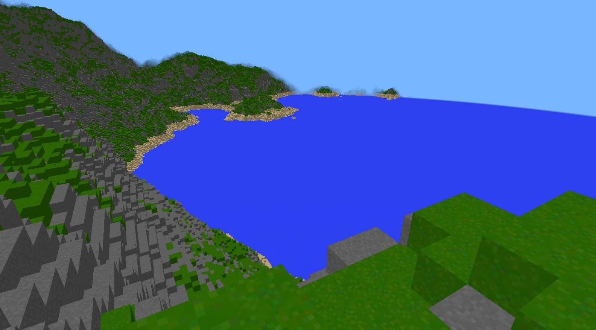

# rustcraft

Another Minecraft clone, using [specs](https://github.com/amethyst/specs) and [glium](https://github.com/glium/glium).

```
cargo run --release
```



## Features

- Player controller with gravity and collision detection.
- Procedurally generated world with varying terrain.
- Hand-written OpenGL renderer.

## Planned work

- Renderer capable of simple lighting.
- Occlusion culling.
- Trees!

## License

Licensed under either of

- Apache License, Version 2.0
  ([LICENSE-APACHE](LICENSE-APACHE) or http://www.apache.org/licenses/LICENSE-2.0)
- MIT license
  ([LICENSE-MIT](LICENSE-MIT) or http://opensource.org/licenses/MIT)

at your option.

## Contribution

All contributions are welcome. Feel free to open issues for fixes or discussing changes. I am particularly interested in any optimisations on the rendering code.

Unless you explicitly state otherwise, any contribution intentionally submitted
for inclusion in the work by you, as defined in the Apache-2.0 license, shall be
dual licensed as above, without any additional terms or conditions.
